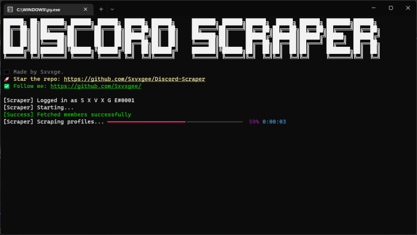

# <p align=center> Discord Guild Members Scraper
## <p align=center> Check out my other project<br>[Darkend](https://darkend.tech)

- Give the project a star if you liked it! It'll help other people find it :)
- This project uses [discord.py-self](https://github.com/dolfies/discord.py-self). Using selfbots is against Discord's TOS, use this project at your own risk.
- The goal of the project is scraping users in a specifed guild. Scrapes pfps, usernames, IDs, pfp urls and bios. 
- You can buy me a coffee if this project has helped you and you wanted to support me!

<a href="https://www.buymeacoffee.com/sxvxge"  target="_blank">

</a>

### Features
- Ability to scrape the profile pictures of members in the following formats:
  - `webp`
  - `png`
  - `jpg`
  - `jpeg`
- Scrape all members Usernames, Discrimnators, IDs, Bios and PFPs to a `txt` file.
- Ability to specify which guilds to scrape in the JSON config file.
- Each guild has it's own folder so the data is easy to handle.

### Notes
- There are plenty of things that could be added to the script, feel free to contribute!
- This project is inspired by sertchan's [JS-based tool](https://github.com/sertchan/Discord-Scraper).

### Installation
   
- Clone repo from git
```sh
>>> git clone https://github.com/Sxvxgee/Discord-Scraper
```

- Install the dependencies.
```sh
>>> pip install -r requirements.txt
```

- Rename `config.json.example` to `config.json` and edit required settings.
```json
{
  "token": "",
  "guild_id": 0,
  "pfp_format": "png"
}
```

### Usage
```sh
>>> cd Discord-Scraper/source
>>> python main.py 
```

### Project screenshots
 
 
 

## License Disclaimer
This project is licensed under the MIT license.
