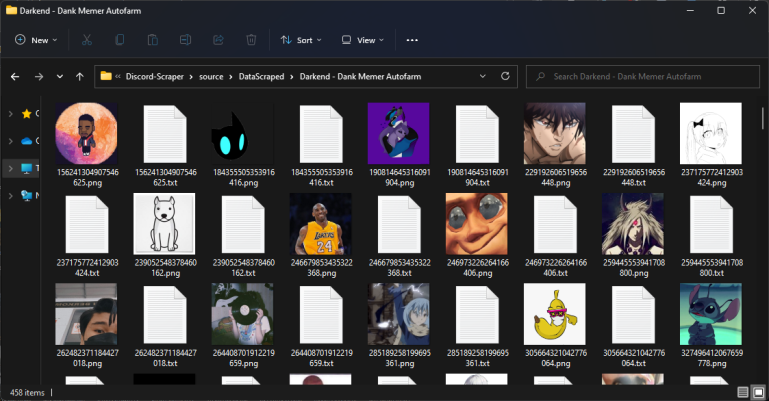

<!-- <p align='center'> -->
# <p align=center> Discord Guild Members Scraper
## <p align=center> Check out my other project<br>[Darkend](https://darkend.tech)

<!-- </p> -->

- ⭐ Give the project a star if you liked it! It'll help other people find it :)

- 🔥 You can buy me a coffee if this project has helped you and you wanted to support me!

<center>
<a href="https://www.buymeacoffee.com/sxvxge"  target="_blank">
  
</a>
</center>

- ⚠️ This project uses [discord.py-self](https://github.com/dolfies/discord.py-self). Using selfbots is against Discord's TOS, use this project at your own risk.

- ✅ The goal of the project is scraping users in a specifed guild. Scrapes pfps, usernames, IDs, pfp urls and bios. 

<center> 
<h1>👾 Features </h1>
</center>

  -  Ability to scrape the profile pictures of members in the following formats:
     -  `webp`
     -  `png`
     -  `jpg`
     -  `jpeg`
  -  Scrape all members Usernames, IDs, Bios, and Discriminators to a `txt` file.
  -  Ability to specify which guilds to scrape in the JSON config file.
  -  Each guild has it's own folder so the data is easy to handle.

<center> 
<h1>📝 Notes</h1>
</center>
  - 👍🏻 There are plenty of things that could be added to the script, feel free to contribute! 
  
  - ❗ This project is inspired by [sertchan](https://github.com/sertchan)'s [JS-based tool](https://github.com/sertchan/Discord-Scraper).
  <br><br>


<center> 
<h1>🐍 Installation</h1>
</center>

   
1- Clone repo from git.
```sh
>>> git clone https://github.com/Sxvxgee/Discord-Scraper
```

2 - Set the settings under `config.json`

```json
{
    "guild_id": 0,
    "token": "",
    "format": "png"
}
```

3 - Install the dependencies:

```sh
>>> pip install -r requirements.txt
```

<center> 
<h1>⚡ Usage</h1>
</center>
    
```sh
>>> python main.py 
```
<center>
<h1>🏆 Project screenshots<h1>
 
 
 
</center>

<center>
<h2>🔎 License </h2>
<p>MIT License </p>
</center>